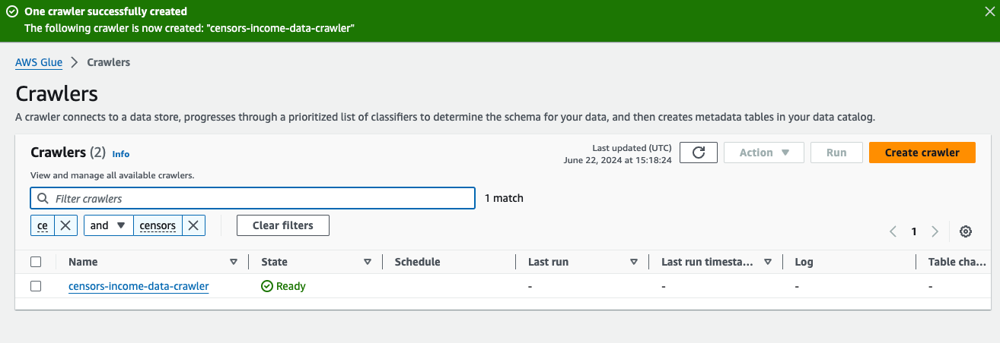
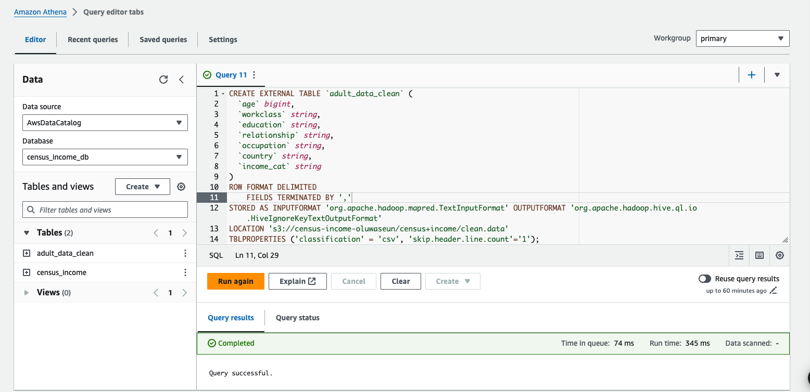
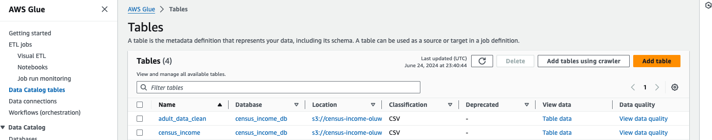
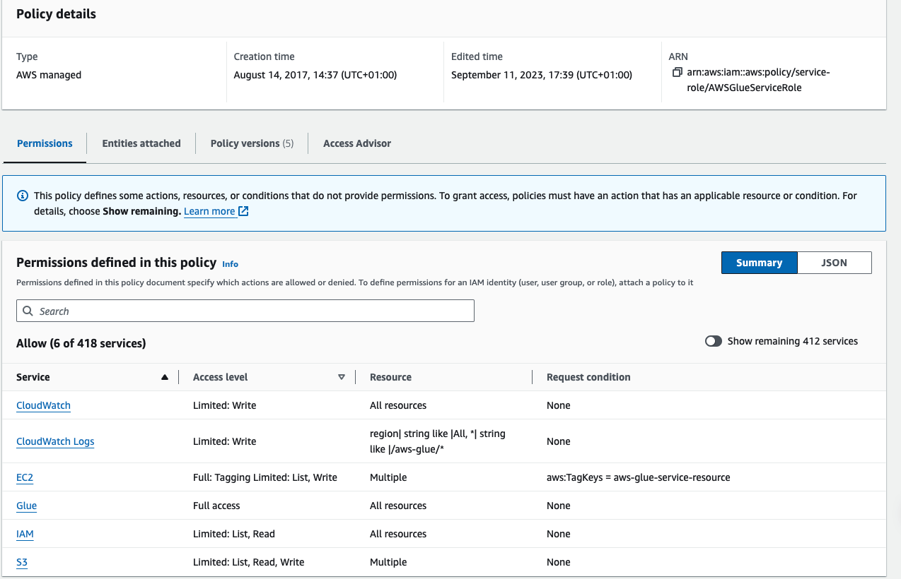
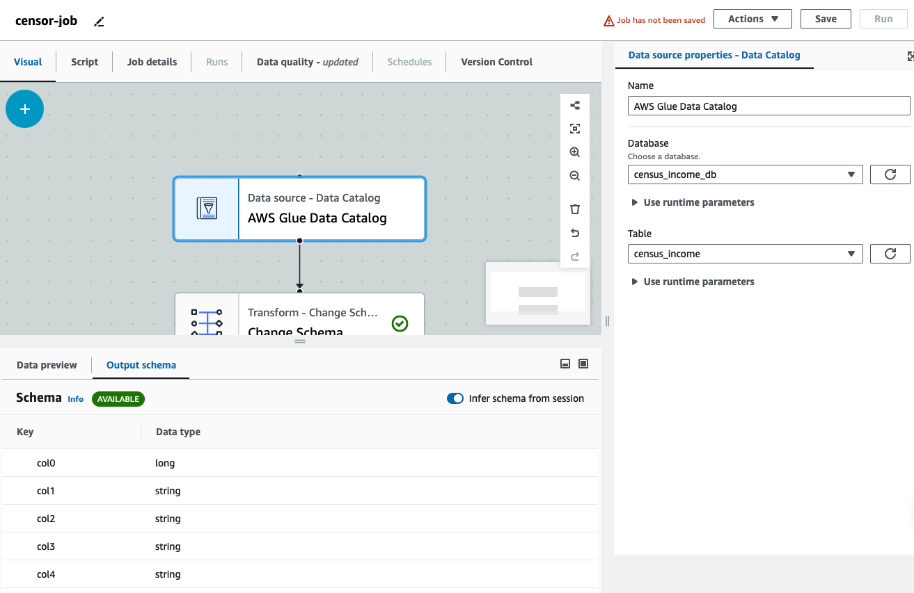
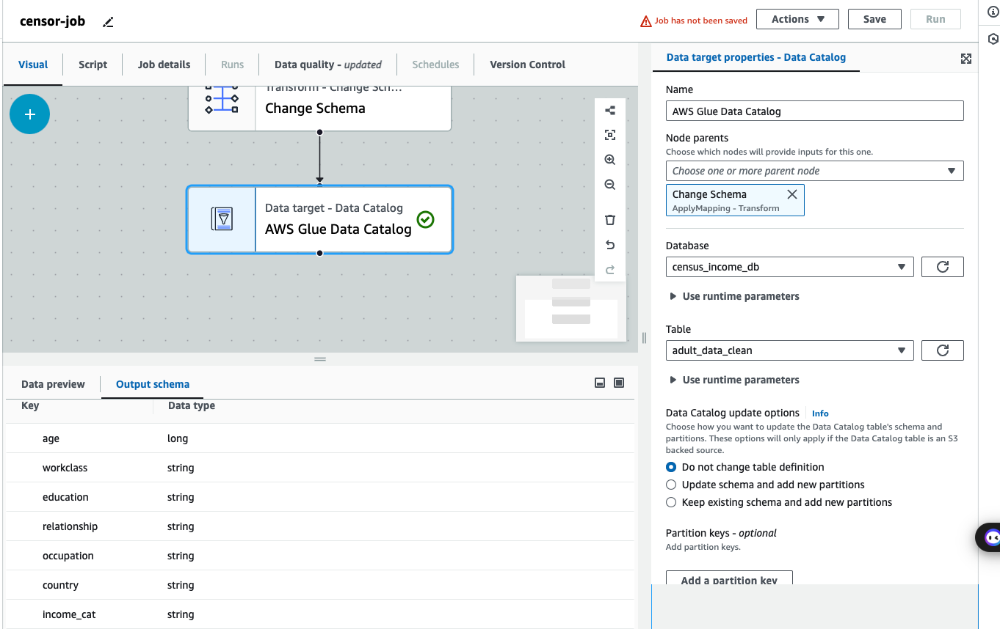
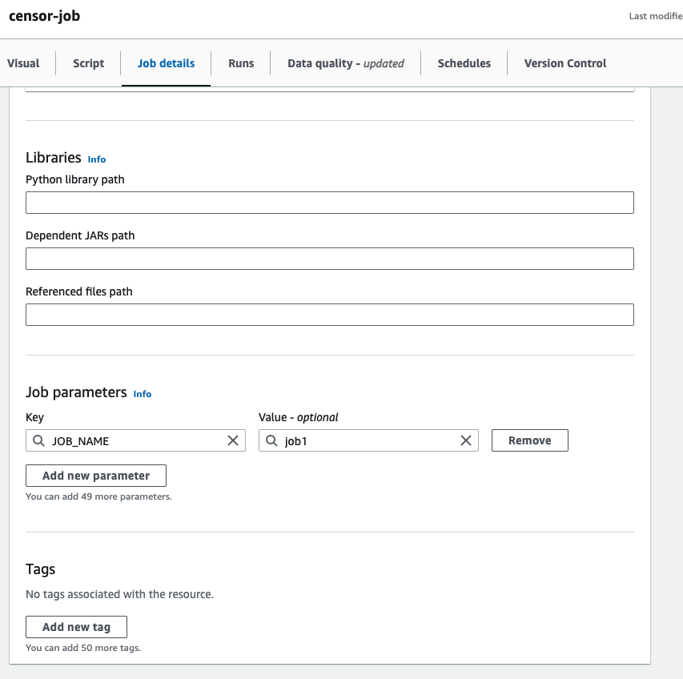
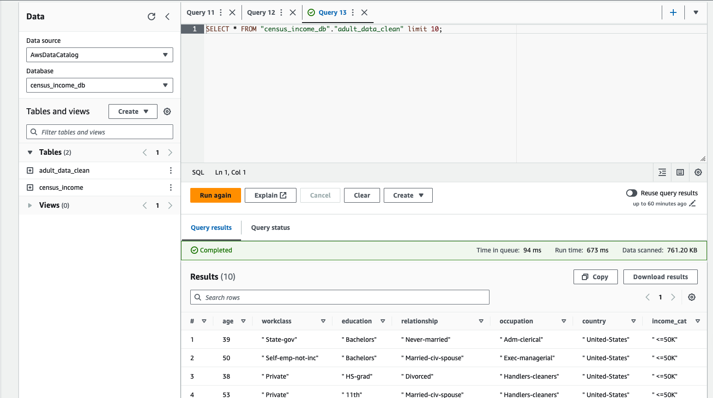

# Income-predictor

## Introduction 
This projects builds a machine learning algorithm to predict whether income exceeds $50k/yr based on census data. However the main goal of this project is to demonstrate how to leverage distributed services by launching an EMR cluster configuration with pre-installed Apache Spark as well as using AWS Glue for ETL.


## Technology Used

Apache Spark

We’ll introduce you to Apache Spark and how it can be used to perform machine learning both at scale and speed. Apache Spark is an open-source cluster-computing framework.

Amazon Elastic Map Reduce

We’ll introduce you to Amazon’s Elastic MapReduce service, or EMR for short. EMR provides a managed Hadoop framework that makes it easy, fast, and cost-effective to process vast amounts of data. EMR can be easily configured to host Apache Spark.

Spark MLlib

We’ll introduce you to MLlib which is Spark’s machine learning module. We’ll discuss how MLlib can be used to perform various machine learning tasks. For this lesson, we'll focus our attention on decision trees as a machine learning method which the MLlib module supports. A decision tree is a type of supervised machine learning algorithm used often for classification problems.

AWS Glue

We’ll introduce you to AWS Glue. AWS Glue is a fully managed extract, transform, and load service, ETL for short. We’ll show you how AWS Glue can be used to prepare our datasets before they are used to train our machine learning models.

Demonstration

Finally, we’ll show you how to use each of the aforementioned services together to launch an EMR cluster configured and pre-installed with Apache Spark for the purpose of training a machine learning model using a decision tree. This demonstration will provide an end-to-end solution that provides machine learning predictive capabilities.

Intended Audience

The intended audience for this lesson includes:

Data scientists and/or data analysts
Anyone interested in learning and performing distributed machine learning, or machine learning at scale
Anyone with an interest in Apache Spark and/or Amazon Elastic MapReduce
Learning Objectives

By completing this lesson, you will: 

Understand what Distributed machine learning is and what it offers
Understand the benefits of Apache Spark and Elastic MapReduce
Understand Spark MLlib as machine learning framework
Create your own distributed machine learning environment consisting of Apache Spark, MLlib, and Elastic MapReduce.
Understand how to use AWS Glue to perform ETL on your datasets in preparation for training a your machine learning model
Know how to operate and execute a Zeppelin notebook, resulting in job submission to your Spark cluster
Understand what a machine learning Decision Tree is and how to code one using MLlib
Prerequisites

The following prerequisites will be both useful and helpful for this lesson:

A background in statistics or probability
Basic understanding of data analytics
General development and coding experience
AWS VPC networking and IAM security experience (for the demonstrations)
Lesson Agenda

The agenda for the remainder of this lesson is as follows:

We’ll discuss what Distributed Machine Learning is and when and why you might consider using it
We’ll review the Apache Spark application, and its MLlib machine learning module
We’ll review the Elastic MapReduce service
We’ll provide an understanding what a Decision Tree is - and what types of analytical problems it is suited towards
We’ll review the basics of using Apache Zeppelin notebooks - which can be used for interactive machine learning sessions
We’ll review AWS Glue. We’ll show you how you can use AWS Glue to perform ETL to prepare our datasets for ingestion into a machine learning pipeline.
Finally - We’ll present a demonstration of a fully functional distributed machine learning environment implemented using Spark running on top of an EMR cluster

## Solution Breakdown

1. Download the dataset:
    ```bash
        wget https://archive.ics.uci.edu/static/public/20/census+income.zip
    ```
2. Unzip the file 
    ```bash
        mkdir census_income/
        tar -xvzf census+income.zip -C census_income
    ```
3. Set up aws cli on your local machine 
4. Create an S3 bucket 
5. Push the folder to your bucket
    ```bash
        aws s3 cp census_income/adult.data s3://census-income-oluwaseun/census+income/ 
    ```
6. Set up the crawler 
   1. select the `census+income` as the source
   2. Create Iamrole with access to s3 and glue
   3. Create table to store the data
   4. Run crawler
   5. Then confrim all these have been create successfully
   
    

7. Define a new table schema where the transformed data will be stored into using AWS Athena. This will be registered back into the data catalogue
   
    

8. Confirm the table has been created in AWS data catalogue
   
    

9.  Create an Iam Role which will allows access to S3, CloudWatchLogs, and Glue services `AWSGlueServiceRole`
    
    

10. Set up ETL job 
    1.  Choose data source
   
    

    2.  Applying mapping to the target columns and drop irrelevant columns.
   
    
    
    3.  Choose data target.
   
    
    
    4.  Set value for `JOB_NAME` variable
   
    

    5.  Run the ETL job and query the database
   
    
    
11. Create EMR Cluster to launch Spark and Jupyter notebook and access to Glue data catalogue
    1.  Select necessary application bundle
   
    

    2.  Select the no of core and task nodes
12. Add inbound rule for port 22 to the master node
13. ssh into the master node 
    ```bash
        ssh -v -i testkey.pem hadoop@ec2-18-234-245-17.compute-1.amazonaws.com
    ``` 
14. Setup ssh port forwarding for zeppelin port 
    ```bash
        ssh -i testkey.pem -N -f -L localhost:8890:localhost:8890 hadoop@ec2-54-173-25-210.compute-1.amazonaws.com
    ``` 
15. Confirm if the port forwarding has been launched succesfully 
16. 
