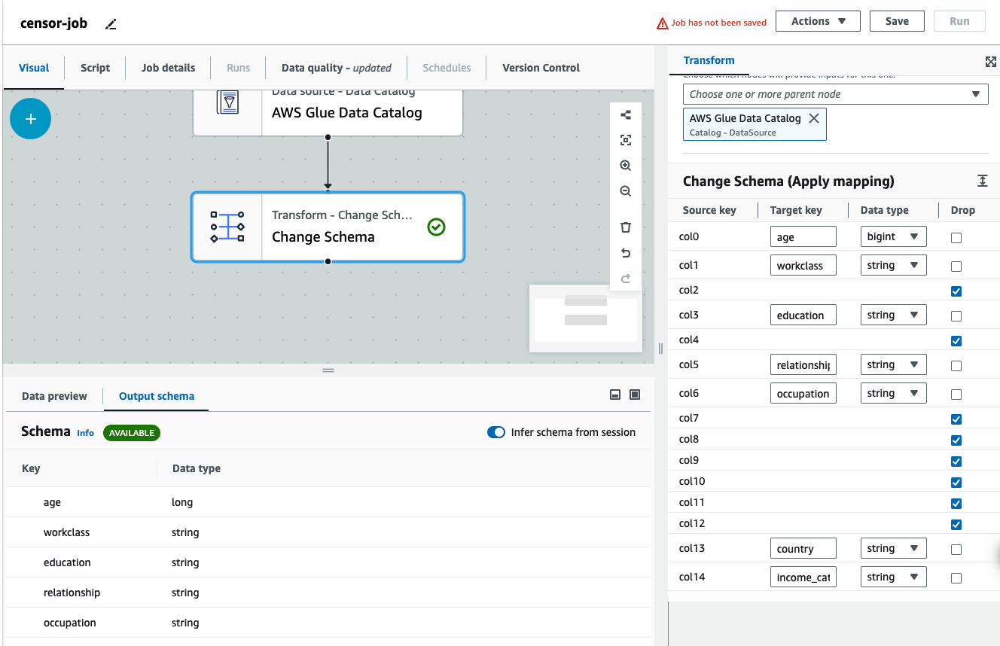

# Income-predictor

## Introduction 
This projects shows how to train a machine learning algorithm to predict whether income exceeds $50k/yr based on census data. However the main goal of this project is to demonstrate how to leverage distributed services by launching an EMR cluster configuration with pre-installed Apache Spark as well as using AWS Glue for ETL.


## Technology Used

Apache Spark

Apache Spark is an open-source unified analytics engine designed for large-scale data processing, offering high-level APIs in Java, Scala, Python, and R, and an optimized engine that supports general execution graphs. It provides in-memory computing capabilities to deliver up to 100 times faster performance for certain data processing workloads compared to traditional disk-based frameworks like Hadoop.

Amazon Elastic Map Reduce

Amazon Elastic MapReduce (EMR) is a cloud-based service that simplifies running big data frameworks like Apache Hadoop and Apache Spark on AWS to process and analyze vast amounts of data. It automates cluster provisioning, configuration, and tuning, allowing users to focus on data analysis without managing the underlying infrastructure.

Spark MLlib

Apache Spark MLlib is a scalable machine learning library built on top of Apache Spark, providing high-level APIs and tools for common machine learning algorithms and data preprocessing tasks. It leverages Spark's distributed computing capabilities to handle large-scale data efficiently.

AWS Glue

AWS Glue is a fully managed ETL (Extract, Transform, Load) service that simplifies data preparation and loading for analytics by automating the process of data discovery, cataloging, and data transformation. It allows you to easily integrate, clean, enrich, and move data across your data stores and data lakes.


## Solution Breakdown

1. Download the dataset:
    ```bash
        wget https://archive.ics.uci.edu/static/public/20/census+income.zip
    ```
2. Unzip the file 
    ```bash
        mkdir census_income/
        tar -xvzf census+income.zip -C census_income
    ```
3. Set up aws cli on your local machine 
4. Create an S3 bucket 
5. Push the folder to your bucket
    ```bash
        aws s3 cp census_income/adult.data s3://census-income-oluwaseun/census+income/ 
    ```
6. Set up the crawler 
   1. select the `census+income` as the source
   2. Create Iamrole with access to s3 and glue
   3. Create table to store the data
   4. Run crawler
   5. Then confrim all these have been create successfully
   
    

7. Define a new table schema where the transformed data will be stored into using AWS Athena. This will be registered back into the data catalogue
   
    

8. Confirm the table has been created in AWS data catalogue
   
    

9.  Create an Iam Role which will allows access to S3, CloudWatchLogs, and Glue services `AWSGlueServiceRole`
    
    

10. Set up ETL job 
    1.  Choose data source
   
    

    2.  Applying mapping to the target columns and drop irrelevant columns.
   
    
    
    3.  Choose data target.
   
    
    
    4.  Set value for `JOB_NAME` variable
   
    

    5.  Run the ETL job and query the database
   
    
    
11. Create EMR Cluster to launch Spark and Jupyter notebook and access to Glue data catalogue
    1.  Select necessary application bundle
   
    

    2.  Select the no of core and task nodes
12. Add inbound rule for port 22 to the master node. 
13. ssh into the master node 
    ```bash
        ssh -v -i testkey.pem hadoop@ec2-18-234-245-17.compute-1.amazonaws.com
    ``` 
14. Setup ssh port forwarding for jupyterhub port 9443
    ```bash
        ssh -i testkey.pem -L localhost:9443:localhost:9443 hadoop@ec2-18-207-230-29.compute-1.amazonaws.com
    ``` 
15. Login to jupyter via `http://localhost:9443`
    
    Note: if you are logging in for the first time the user name is `jovyan` and the password is `jupyter`. Also jupyter configuration files can be found here `/etc/jupyter/conf/`
16. Dowload training notebook and run cells
    ```bash
        cd /mnt/var/lib/jupyter/home/jovyan/
        sudo aws s3 cp s3://census-income-oluwaseun/census+income/training.ipynb .
    ``` 